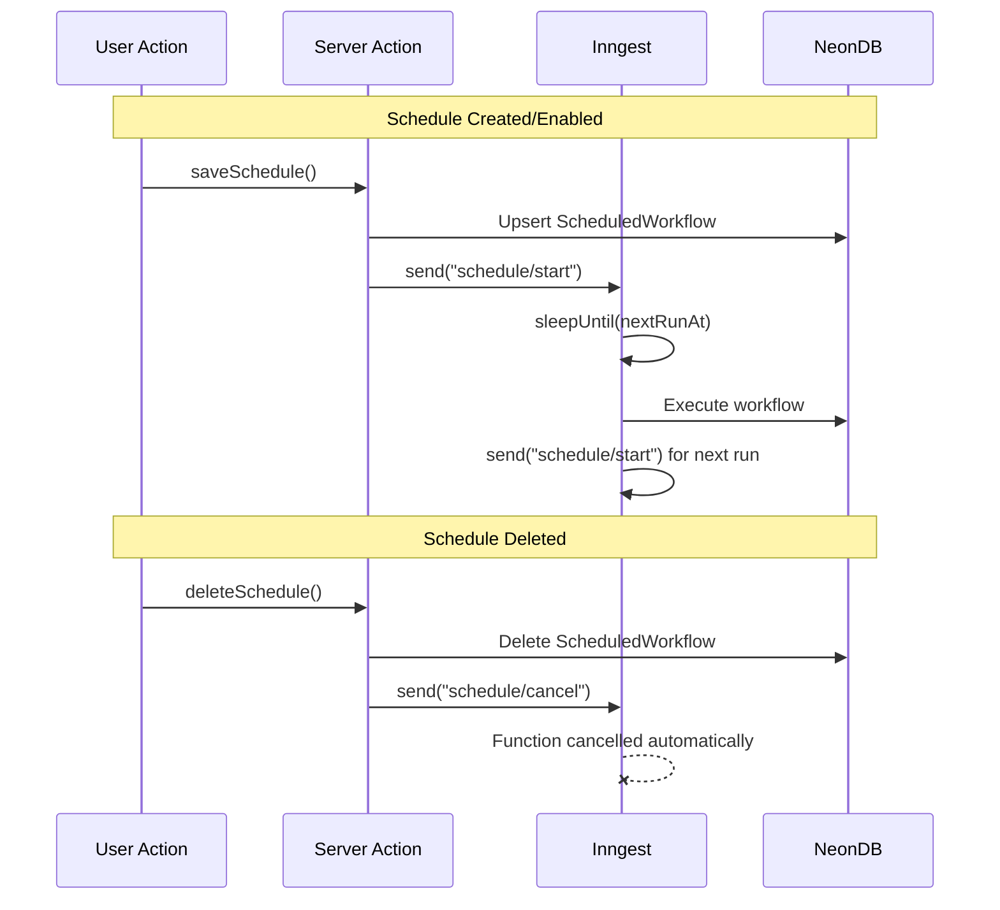

# Event-Driven Schedule Execution (Eliminate Polling)

## Problem

The current approach uses a cron job that runs **every minute** to poll the database for due schedules. This was implemented as a workaround when schedules continued running after their nodes were deleted. However, this consumes:

- ~1,440 Inngest invocations/day
- ~1,440 NeonDB queries/day
- Continuous compute even when no schedules exist

## Proposed Solution: Self-Scheduling Functions with Cancellation

Replace polling with **event-driven, per-schedule functions** that:

1. Sleep until `nextRunAt` using `step.sleepUntil()`
2. Auto-cancel when a `schedule/cancel` event is sent
3. Self-chain to schedule the next run



## Key Changes

### 1. New Inngest Function: `executeScheduledWorkflow`

Create a new function in [`src/inngest/schedule-executor.ts`](src/inngest/schedule-executor.ts):

```typescript
export const executeScheduledWorkflow = inngest.createFunction(
  {
    id: "execute-scheduled-workflow",
    cancelOn: [
      { event: "schedule/cancel", match: "data.scheduleId" },
    ],
  },
  { event: "schedule/start" },
  async ({ event, step }) => {
    const { scheduleId } = event.data;
    
    // 1. Fetch schedule from DB (verify it still exists)
    const schedule = await step.run("get-schedule", () => 
      prisma.scheduledWorkflow.findUnique({ where: { id: scheduleId } })
    );
    
    if (!schedule || !schedule.enabled) return { skipped: true };
    
    // 2. Sleep until nextRunAt
    if (schedule.nextRunAt && schedule.nextRunAt > new Date()) {
      await step.sleepUntil("wait-for-schedule", schedule.nextRunAt);
    }
    
    // 3. Re-verify schedule still exists (could be deleted during sleep)
    const currentSchedule = await step.run("verify-schedule", () =>
      prisma.scheduledWorkflow.findUnique({ where: { id: scheduleId } })
    );
    
    if (!currentSchedule || !currentSchedule.enabled) return { cancelled: true };
    
    // 4. Execute the workflow
    await step.run("trigger-workflow", async () => {
      // ... trigger workflow execution
    });
    
    // 5. Calculate next run and chain to self
    const nextRunAt = calculateNextRunAt(currentSchedule);
    await step.run("schedule-next", async () => {
      await prisma.scheduledWorkflow.update({ ... });
      await inngest.send({ name: "schedule/start", data: { scheduleId } });
    });
  }
);
```

### 2. Update Schedule Actions

Modify [`src/features/triggers/components/schedule-trigger/actions.ts`](src/features/triggers/components/schedule-trigger/actions.ts):

**In `saveSchedule()`** - Send start event after creating/enabling:

```typescript
await inngest.send({ name: "schedule/start", data: { scheduleId: scheduledWorkflow.id } });
```

**In `deleteSchedule()`** - Send cancel event before deleting:

```typescript
await inngest.send({ name: "schedule/cancel", data: { scheduleId: schedule.id } });
await prisma.scheduledWorkflow.delete({ where: { id: schedule.id } });
```

**In `toggleSchedule()`** - Send appropriate event:

```typescript
if (enabled) {
  await inngest.send({ name: "schedule/start", data: { scheduleId } });
} else {
  await inngest.send({ name: "schedule/cancel", data: { scheduleId } });
}
```

### 3. Update Workflow Router

Modify [`src/features/workflows/server/routers.ts`](src/features/workflows/server/routers.ts) to send cancel events when nodes are deleted:

```typescript
// Before deleting scheduled workflows for removed nodes
const schedulesToCancel = await tx.scheduledWorkflow.findMany({
  where: { workflowId: id, nodeId: { in: nodeIdsToDelete } },
  select: { id: true },
});

for (const schedule of schedulesToCancel) {
  await inngest.send({ name: "schedule/cancel", data: { scheduleId: schedule.id } });
}
```

### 4. Remove Polling Function

Delete or disable [`src/inngest/schedule-poller.ts`](src/inngest/schedule-poller.ts) and remove it from [`src/app/api/inngest/route.ts`](src/app/api/inngest/route.ts).

## Resource Comparison

| Metric | Current (Polling) | Proposed (Event-Driven) |

|--------|------------------|------------------------|

| Idle cost | 1,440 invocations/day | 0 |

| DB queries (idle) | 1,440/day | 0 |

| Per schedule | 2-3 extra queries/run | 3-4 queries/run |

| Cleanup | Manual/error-prone | Automatic via cancelOn |

## Migration Strategy

1. Deploy new event-driven function alongside existing poller
2. For existing schedules, trigger `schedule/start` events via a one-time migration script
3. Monitor for 24-48 hours
4. Remove poller function